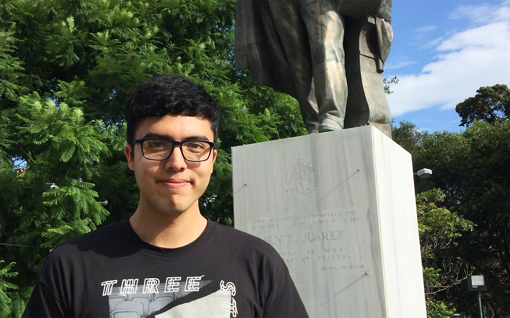

# Projects

Here you can find some of the projects that I have worked on in the past.

## [pPXF Assistant](https://github.com/DiegoGH117/ppxf_assistant)
This package is designed to assist in the application of the PPxF method to Integrated Field Spectra (IFS), to be able to extract the internal kinematics of galaxies. One major focus of this package is to make the process more interactive so that the user has a better grasp of what is being done.

## [CellARE](https://github.com/DiegoGH117/cellare)
The Cellular Automata Resource for Epidemiology is small package contains two classes that can be used to simulate SIR scenarios using cellular automata. Check the example Jupyter Notebook for more.

## [Galaxy Simulations using AMUSE]()
Repository where I keep a few scripts used to simulate galaxies using [AMUSE](https://amusecode.github.io), as well some of the results from them. The purpose for these simulations is to create galaxies with different morphologies to study their internal dynamics.

At this point I am just trying really hard lol.

